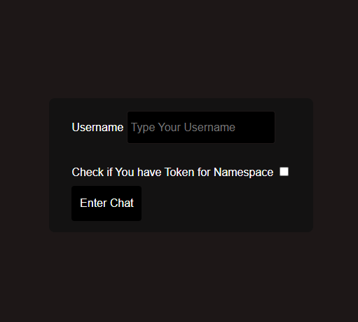
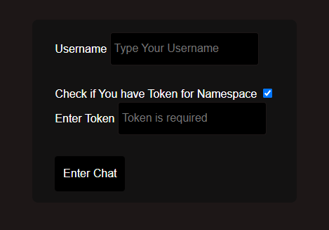
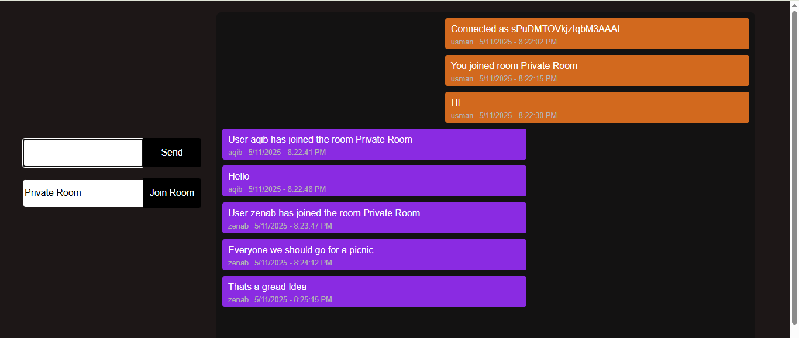
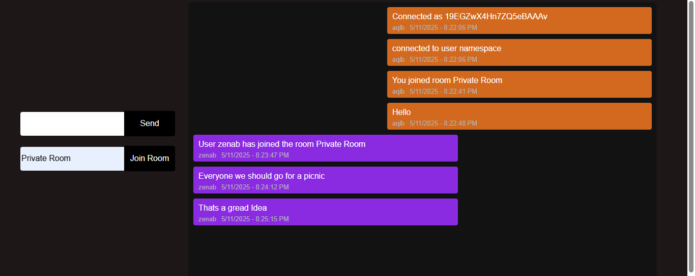

# Chat-App
💬 Real-Time Chat App with Socket.IO
Welcome to the Real-Time Chat App — a powerful Node.js-based application that enables instant messaging across multiple chat rooms and dedicated namespaces. Built using Socket.IO, this app provides a scalable and interactive communication experience.

🔧 Features:
🧑‍🤝‍🧑 Multiple Chat Rooms – Users can join any room by name and exchange messages in real-time.

🌐 Namespaces Support – Logical separation of services (like /user, /admin, etc.) to enable scalable, modular architecture.

👤 User Identification – Users provide a username, which is shown with every message.

⏱️ Live Messaging – Messages are timestamped and displayed instantly.

🔌 Connect/Disconnect Events – Users can join or leave via keyboard shortcuts (Enter to connect, Escape to disconnect).

🧪 Room-specific Broadcasting – Messages are scoped to the room they’re sent in.

| S1 | S2 |
|----|----|
|  |  |

| S3 | S4 | S5 |
|----|----|----|
|  |  |  |


## Instructions:
```
git clone git@github.com:aqibaMalik/Chat-App.git
cd client
npm install
npm run dev/your script
```
**Now Do same for Server**
```
cd server
npm install
npm run dev/your script
```
Built with 💕 Aqib malik
